# flag-icons 
A beautiful `svg` + `png` + `sass` + `css` collection of countries flags by [Yefferson Marín](https://github.com/yammadev).

# Icons
All `sketch` files are in [madebybowtie/FlagKit](https://github.com/madebybowtie/FlagKit). Currently `svg` is just supported in [this](https://github.com/lucidlemon/FlagKit) fork, and it's still pending for integration.

# Looking for brand icons?
Check out [yammadev/brand-icons](https://github.com/yammadev/brand-icons).

# How to?
## Use it
**1.** Add the compiled `css` file to your `html`.

```html
  <!-- Use generated lib -->
  <link rel="stylesheet" href="/css/flag-icons.css">

  <!-- Compressed -->
  <link rel="stylesheet" href="/css/flag-icons.min.css">
```

**2.** Download the `svg` icons in your path and use `<i>` or `<span>` tags adding the class `flag-icons` followed of the flag `code` (look **Reference** for details) which is the [ISO 3166-1-alpha-2 code](https://en.wikipedia.org/wiki/ISO_3166-1_alpha-2) for each one. The result is a rectangular flag, however, the `square` class can be used if a squared one is required.

```html
  <!-- Using <i> -->
  <i class="flag-icons CO"></i>
  <i class="flag-icons square CO"></i>

  <!-- Using <span> -->
  <span class="flag-icons CO"></span>
  <span class="flag-icons square CO"></span>
```

**3.** You can also format the default size of the flag in a custom `css` file:

```css
  .flag-icons,    /* Format default wrapper */
  .rectangle {    /* Or use as new class */
    height: 2em !important;
    width: 2.66667em !important;
    line-height: 2em !important;
  }

  .flag-icons,    /* Format default wrapper */
  .square,        /* Format default square class */
  .squared {      /* Or use as new class */
    height: 2em !important;
    width: 2em !important;
    line-height: 2em !important;
  }
```

```html
  <!-- Rectangle -->
  <i class="flag-icons CO"></i>
  <i class="flag-icons rectangle CO"></i>

  <!-- Square -->
  <i class="flag-icons CO"></i>
  <i class="flag-icons square CO"></i>
  <i class="flag-icons squared CO"></i>
```

## Auto generate
**1.** In `svg` folder let just the files you need or desire. then edit `sass/_variables.scss` as followed:

```scss
  // ...
  $flags: (
    'code'
    ...
    'code'
  );
```

Where `'code'` represents the names of the flags desired.

**2.** Run in terminal:

```bash
  # Install dependencies
  $ npm install

  # Build!  
  $ grunt build
```

**3.** It will generate automatically:

```
  /css    <-- .css, .min.css
  /sass   <-- .scss
```

**4.** Use as usual.

# Reference
## Extras
| Flag  | Code  | Region |
| :---: | :---: | :----- |
|   | EU    | European Union |
|   | WW    | World |
| | CNA   | North America |
| | CSA   | South America |
| | CEU   | Europe |
| | CAF   | Africa |
| | CAS   | Asia |
| | COC   | Oceania |

## Countries
| Flag  | Code  | Country |
| :---: | :---: | :----- |
|  | AD | Andorra |
|  | AE | United Arab Emirates |
|  | AF | Afghanistan |
|  | AG | Antigua & Barbuda |
|  | AI | Anguilla |
|  | AL | Albania |
|  | AM | Armenia |
|  | AO | Angola |
| 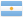 | AR | Argentina |
|  | AT | Austria |
|  | AU | Australia |
| 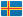 | AX | Åland Islands |
|  | AZ | Azerbaijan |
|  | BA | Bosnia & Herzegovina |
|  | BB | Barbados |
| 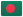 | BD | Bangladesh |
|  | BE | Belgium |
|  | BF | Burkina Faso |
| 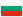 | BG | Bulgaria |
|  | BH | Bahrain |
|  | BI | Burundi |
|  | BJ | Benin |
|  | BM | Bermuda |
|  | BN | Brunei |
|  | BO | Bolivia |
|  | BR | Brazil |
|  | BS | Bahamas |
|  | BT | Bhutan |
|  | BW | Botswana |
|  | BY | Belarus |
|  | BZ | Belize |
|  | CA | Canada |
|  | CD | Congo - Kinshasa |
|  | CF | Central African Republic |
|  | CG | Congo - Brazzaville |
|  | CH | Switzerland |
|  | CI | Côte d’Ivoire |
|  | CL | Chile |
| 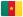 | CM | Cameroon |
|  | CN | China |
|  | CO | Colombia |
|  | CR | Costa Rica |
|  | CU | Cuba |
|  | CV | Cape Verde |
|  | CY | Cyprus |
|  | CZ | Czech Republic |
|  | DE | Germany |
|  | DJ | Djibouti |
|  | DK | Denmark |
| 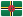 | DM | Dominica |
| 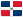 | DO | Dominican Republic |
| 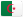 | DZ | Algeria |
| 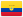 | EC | Ecuador |
|  | EE | Estonia |
|  | EG | Egypt |
| 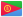 | ER | Eritrea |
|  | ES | Spain |
|  | ET | Ethiopia |
|  | FI | Finland |
|  | FJ | Fiji |
|  | FM | Micronesia |
|  | FR | France |
|  | GA | Gabon |
|  | GB | United Kingdom |
| 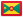 | GD | Grenada |
|  | GE | Georgia |
|  | GH | Ghana |
| 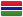 | GM | Gambia |
|  | GN | Guinea |
|  | GQ | Equatorial Guinea |
|  | GR | Greece |
|  | GT | Guatemala |
|  | GW | Guinea-Bissau |
|  | GY | Guyana |
|  | HK | Hong Kong SAR China |
|  | HN | Honduras |
|  | HR | Croatia |
|  | HT | Haiti |
|  | HU | Hungary |
|  | ID | Indonesia |
|  | IE | Ireland |
|  | IL | Israel |
|  | IN | India |
|  | IQ | Iraq |
| 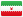 | IR | Iran |
| 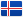 | IS | Iceland |
|  | IT | Italy |
|  | JM | Jamaica |
|  | JO | Jordan |
|  | JP | Japan |
|  | KE | Kenya |
|  | KG | Kyrgyzstan |
|  | KH | Cambodia |
|  | KM | Comoros |
|  | KN | St. Kitts & Nevis |
|  | KP | North Korea |
|  | KR | South Korea |
|  | KW | Kuwait |
|  | KY | Cayman Islands |
|  | KZ | Kazakhstan |
|  | LA | Laos |
|  | LB | Lebanon |
|  | LC | St. Lucia |
|  | LI | Liechtenstein |
|  | LK | Sri Lanka |
|  | LR | Liberia |
| 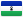 | LS | Lesotho |
|  | LT | Lithuania |
|  | LU | Luxembourg |
|  | LV | Latvia |
|  | LY | Libya |
|  | MA | Morocco |
|  | MC | Monaco |
|  | MD | Moldova |
|  | ME | Montenegro |
|  | MG | Madagascar |
|  | MK | Macedonia |
|  | ML | Mali |
|  | MM | Myanmar (Burma) |
|  | MN | Mongolia |
|  | MO | Macau SAR China |
|  | MR | Mauritania |
|  | MS | Montserrat |
|  | MT | Malta |
|  | MU | Mauritius |
|  | MV | Maldives |
|  | MW | Malawi |
|  | MX | Mexico |
|  | MY | Malaysia |
| 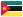 | MZ | Mozambique |
|  | NA | Namibia |
| 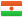 | NE | Niger |
|  | NG | Nigeria |
|  | NI | Nicaragua |
|  | NL | Netherlands |
| 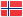 | NO | Norway |
|  | NP | Nepal |
|  | NZ | New Zealand |
| 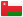 | OM | Oman |
|  | PA | Panama |
|  | PE | Peru |
|  | PG | Papua New Guinea |
|  | PH | Philippines |
|  | PK | Pakistan |
|  | PL | Poland |
|  | PR | Puerto Rico |
| 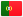 | PT | Portugal |
|  | PW | Palau |
| 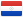 | PY | Paraguay |
|  | QA | Qatar |
|  | RO | Romania |
|  | RS | Serbia |
| 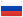 | RU | Russia |
| 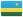 | RW | Rwanda |
|  | SA | Saudi Arabia |
|  | SB | Solomon Islands |
|  | SC | Seychelles |
|  | SD | Sudan |
| 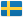 | SE | Sweden |
|  | SG | Singapore |
|  | SI | Slovenia |
|  | SK | Slovakia |
|  | SL | Sierra Leone |
|  | SM | San Marino |
|  | SN | Senegal |
|  | SO | Somalia |
| 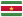 | SR | Suriname |
| 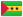 | ST | São Tomé & Príncipe |
| 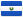 | SV | El Salvador |
|  | SY | Syria |
| 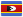 | SZ | Swaziland |
|  | TC | Turks & Caicos Islands |
|  | TD | Chad |
|  | TG | Togo |
|  | TH | Thailand |
|  | TJ | Tajikistan |
|  | TL | Timor-Leste |
|  | TM | Turkmenistan |
|  | TN | Tunisia |
|  | TO | Tonga |
|  | TR | Turkey |
|  | TT | Trinidad & Tobago |
|  | TW | Taiwan |
|  | TZ | Tanzania |
|  | UA | Ukraine |
|  | UG | Uganda |
|  | US | United States |
|  | UY | Uruguay |
| 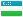 | UZ | Uzbekistan |
|  | VC | St. Vincent & Grenadines |
|  | VE | Venezuela |
|  | VG | British Virgin Islands |
|  | VN | Vietnam |
|  | WS | Samoa |
|  | YE | Yemen |
|  | ZA | South Africa |
|  | ZW | Zimbabwe |

# Todo
- Maybe an index website (?).
- Pull `sketch` files from original source [madebybowtie/FlagKit](https://github.com/madebybowtie/FlagKit) using `grunt-git` instead.
- After pull, convert them in `svg` and `png` format automatically.

# Contribute
Pull requests are most than welcome.

# License
Released under the MIT license.

# Change Log
## [1.2.4] - 2017-07-09
- Code cleaning.
- Readme edited.

## [1.2.3] - 2017-06-27
- Readme edited.

## [1.2.3] - 2017-06-27
- Readme edited.

## [1.2.2] - 2017-06-27
- Link to **ISO 3166-1-alpha-2 code** updated.
- Readme edited.

## [1.2.1] - 2017-06-27
- Readme edited.

## [1.2.0] - 2017-06-27
- `grunt` integrated for better and cleaner approach.
- `png` flags.
- Readme edited.

## [1.1.0] - 2017-06-26
- `sass` better approach.
- Better instructions in Readme.

## [1.0.0] - 2017-06-26
- `svg` flags.
- `sass` boilerplate.
- `css` libraries.

## [0.0.0] - 2017-06-26
- Initial commit.
- Readme + license.
